# AI Client Query Triage

**An assistant for shared client inboxes: it reads each new email, classifies it by type and urgency, looks up the client and your knowledge base, and saves a cited draft reply for a person to review and send.**

It never sends email. Replies are always sent by your team from Gmail or Outlook.


## The problem

Shared support inboxes fill up with repetitive client questions. Replies get
slower, and the urgent ones get buried: a failed payroll run the day before
payday sits between a newsletter and a thank-you note.

## What it does

- **Connects to a Gmail or Microsoft 365 shared inbox.** It uses the Gmail API
  or Microsoft Graph. A built-in demo mailbox runs without any account.
- **Classifies every email** with Gemini:
  - category and urgency, with the reason for the urgency
  - sentiment and complexity
  - escalation flags: legal, regulatory, churn risk, executive, payment deadline
  - search queries for the knowledge base

  Structured outputs return schema-valid JSON.
- **Knows the client.** The sender's address identifies the client record
  (tier, plan, account manager, renewal date, notes). Recent queries from the
  same client are pulled in too.
- **Looks up the knowledge base.** Markdown articles are indexed with SQLite
  full-text search and cited section by section. An adapter connects an
  external knowledge service instead (for example the Project 4 knowledge
  base).
- **Writes a draft reply and saves it in the mailbox, in the same thread.** The
  draft cites the sources it used. Anything the sources don't cover goes on a
  "check before sending" list instead of being guessed. The draft is never
  sent.
- **Routes it to the right person.** Rules pick the assignee and a reply-by
  time. Urgent or complex queries are posted to Slack or Teams immediately.
- **Posts a daily summary** of open and overdue queries, by person and by
  category.
- **Keeps confidential clients away from the AI.** Excluded clients never
  reach the model. They are labelled and routed to a person, and only their
  metadata is stored.

## Before and after

<table>
  <tr>
    <td width="50%">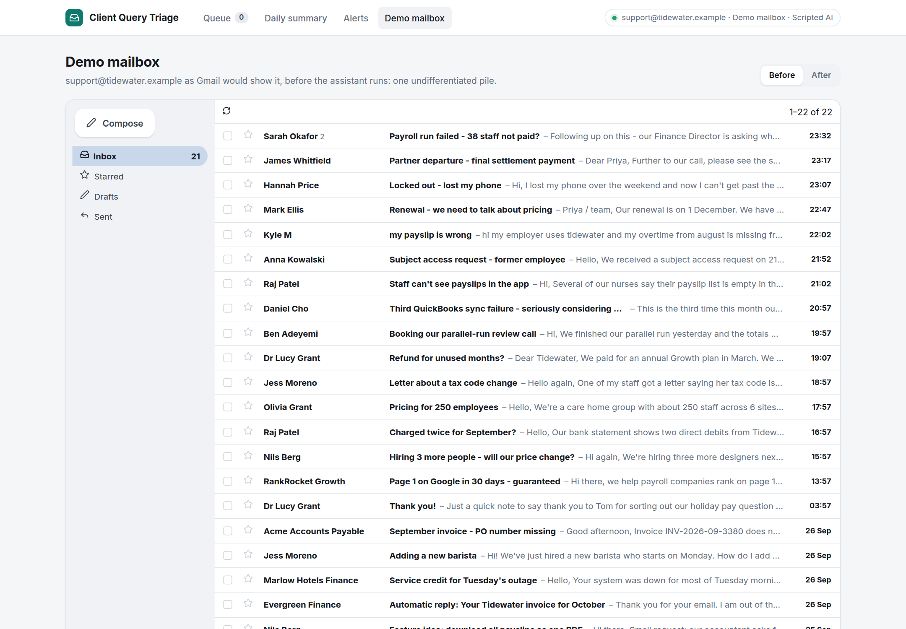</td>
    <td width="50%">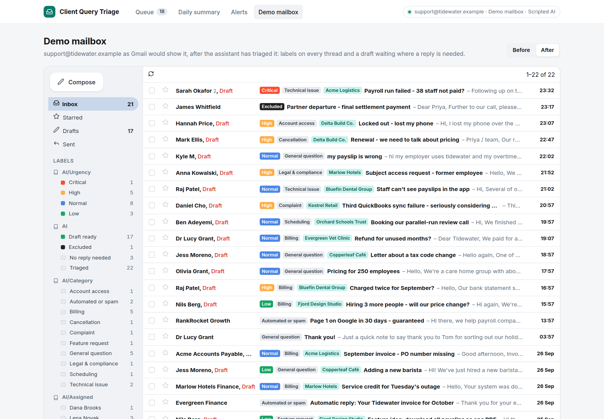</td>
  </tr>
  <tr>
    <td><b>Before.</b> One undifferentiated pile of 22 threads.</td>
    <td><b>After.</b> Every thread is labelled, and 17 already have a draft reply waiting.</td>
  </tr>
</table>

## Screenshots

**The classified queue**: sorted by urgency, then by reply-by time. Overdue queries are shown in red.

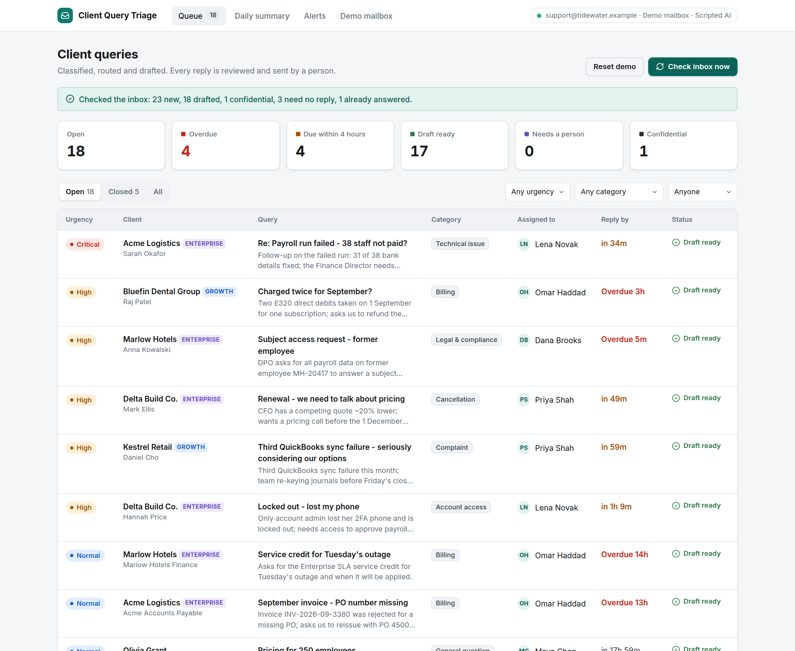

<table>
  <tr>
    <td width="50%">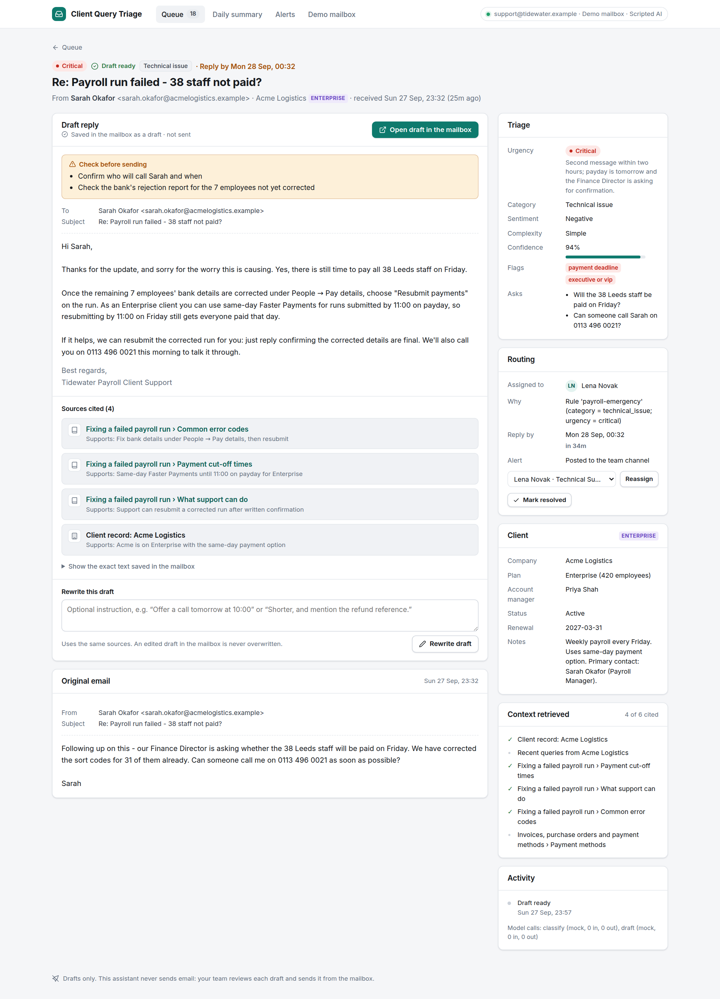</td>
    <td width="50%">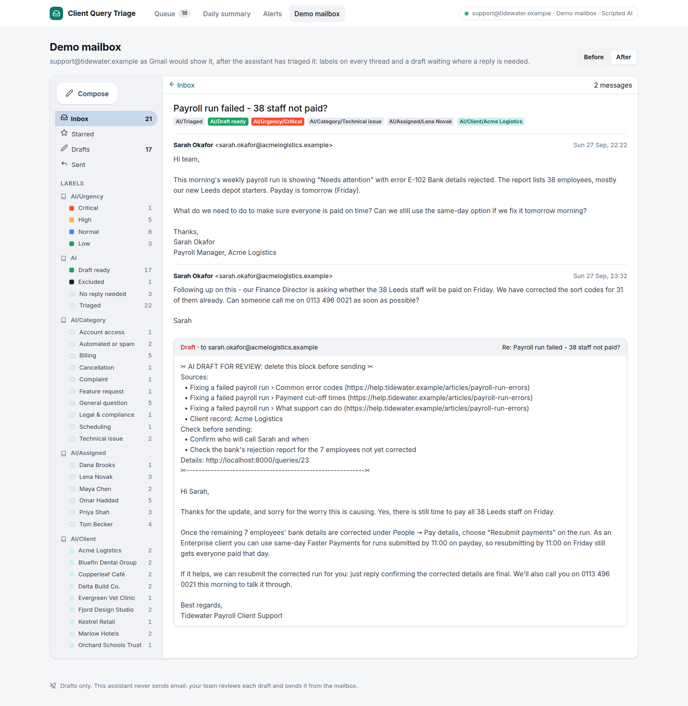</td>
  </tr>
  <tr>
    <td><b>A sample draft.</b> Each claim is backed by a knowledge-base section or the client record. Gaps are listed for the reviewer.</td>
    <td><b>In the mailbox.</b> The draft sits in the thread, ready to edit and send. The reviewer note at the top is deleted before sending.</td>
  </tr>
  <tr>
    <td>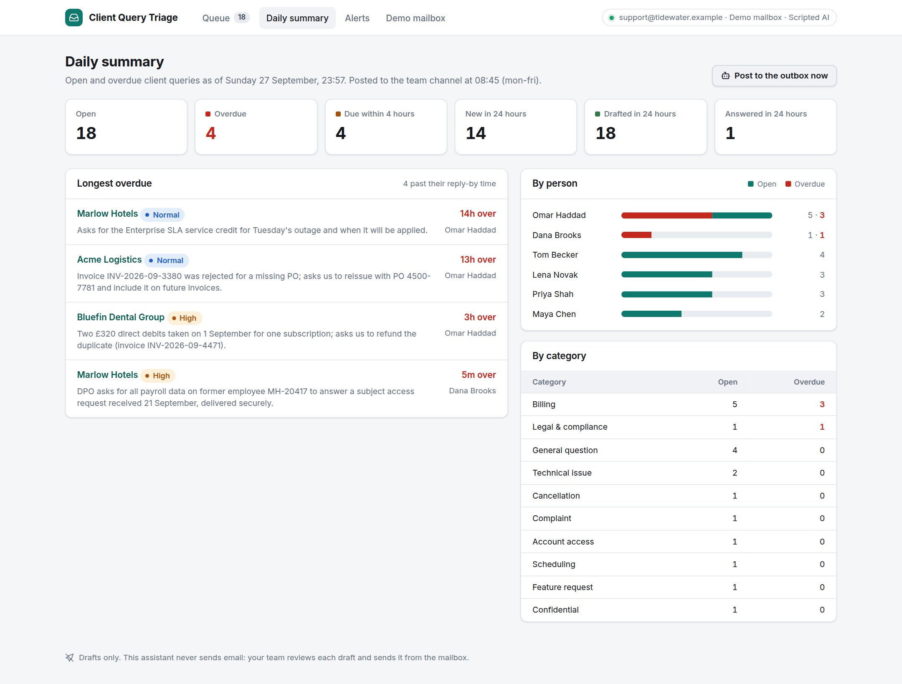</td>
    <td>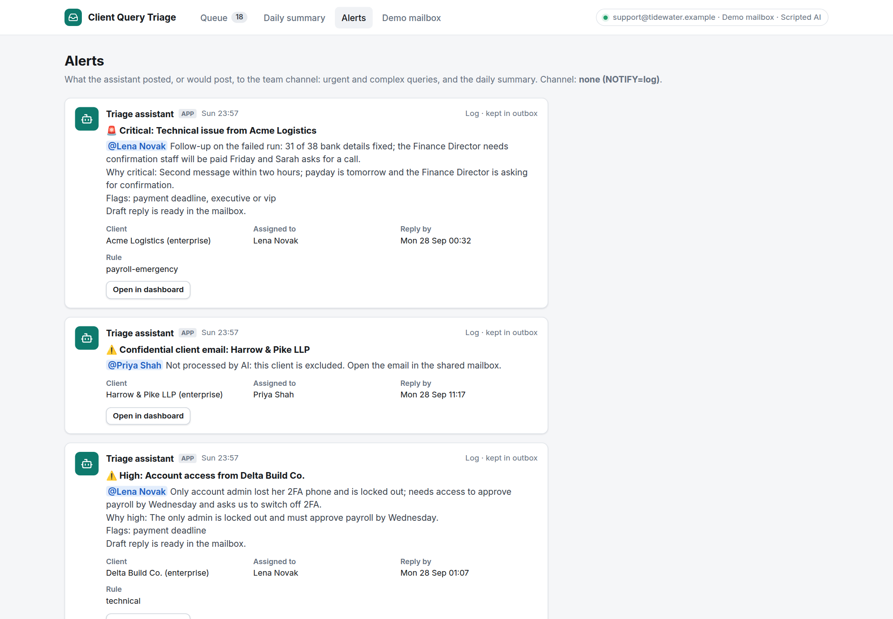</td>
  </tr>
  <tr>
    <td><b>Daily summary.</b> Open and overdue queries, and who they are waiting on.</td>
    <td><b>Alerts.</b> Urgent, complex and confidential queries go to Slack or Teams straight away.</td>
  </tr>
  <tr>
    <td>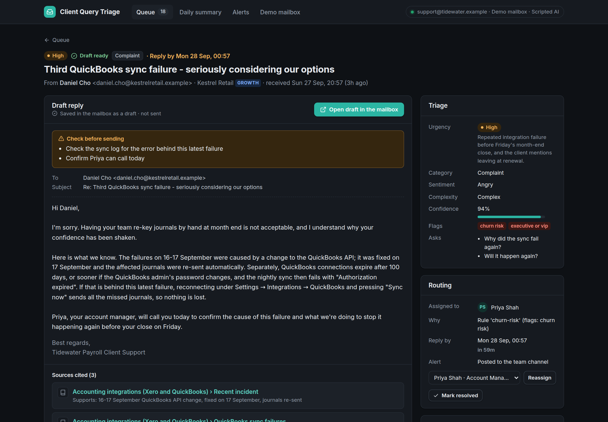</td>
    <td>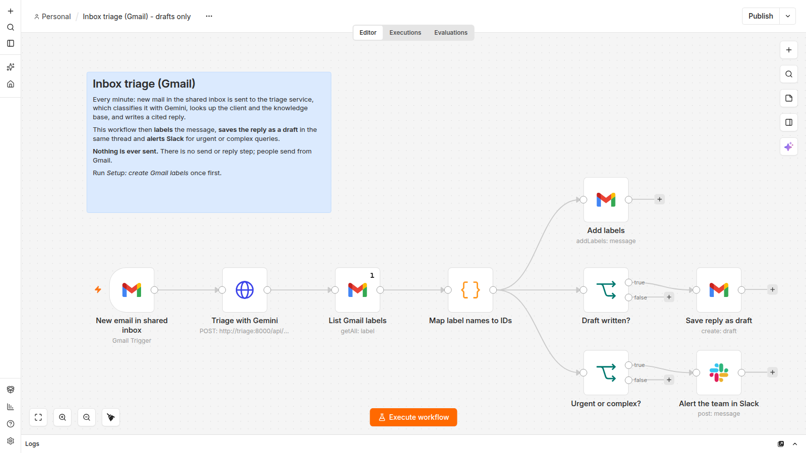</td>
  </tr>
  <tr>
    <td><b>Dark mode.</b> A churn-risk complaint routed to the account manager.</td>
    <td><b>n8n.</b> The same pipeline as an importable n8n workflow.</td>
  </tr>
</table>

<p align="center">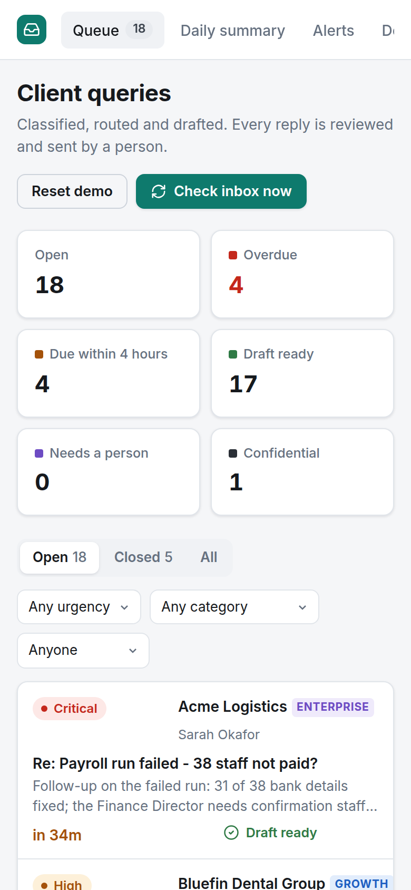</p>

> **About the demo data.** The screenshots use a fictional payroll company,
> Tidewater Payroll, with its clients, help-centre articles and a shared inbox
> of 23 emails. The classifications and drafts in them come from
> `AI_PROVIDER=mock`, a scripted stand-in with hand-written responses. It
> follows the same schemas Gemini fills in production, so the demo runs
> without an API key. Everything else is the real app: the privacy gate,
> retrieval, citation checks, routing, labels, drafts, reply detection and the
> daily summary. With `AI_PROVIDER=gemini` and an API key, the same run uses
> Gemini, and `scripts/capture_media.py` re-shoots the screenshots.

## How it works

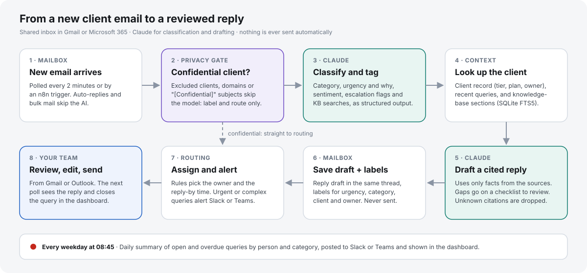

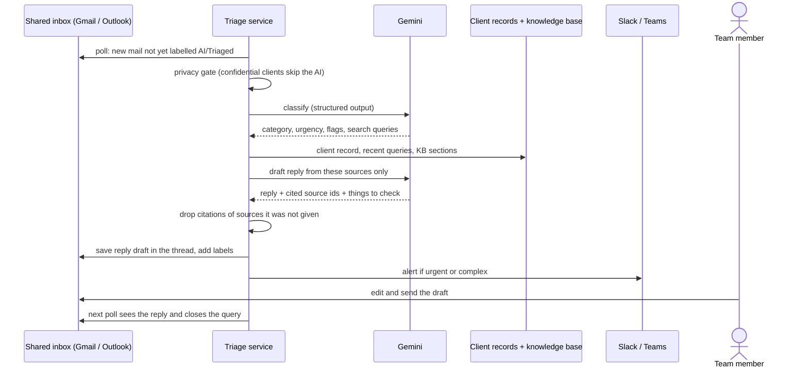

Every step is also available as `POST /api/triage`, which the
[n8n workflows](n8n/README.md) use. In that setup n8n watches the mailbox and
does the mailbox writes itself.

## Accuracy and security safeguards

- **No automatic sending.** The mailbox interface has no send method, and the
  providers call only read, label and draft endpoints.
  [`tests/test_no_send.py`](tests/test_no_send.py) scans the provider code and
  every n8n workflow and fails the build if a send path appears.
  - On Microsoft 365 the app is never granted `Mail.Send`, so the platform
    refuses to send as well.
  - Gmail has no draft-only scope, so there the guarantee rests on the code
    and the tests. [SECURITY.md](docs/SECURITY.md) explains this.
- **Drafts cite their sources.**
  - Each fact in a draft is tied to a knowledge-base section or the client
    record.
  - Citations to anything the model was not given are removed and flagged.
  - A draft with no valid citations, or with low confidence, is marked for a
    careful review.
  - Questions the sources don't answer become a "check before sending" list.
    The draft does not guess them.
- **Confidential clients can be excluded from AI processing.** A client flag,
  domain and address lists, and subject markers such as `[Confidential]` keep
  an email away from the model entirely. Only metadata is stored and alerts
  carry no content. A test asserts the model is never called for these.
- **Client identity is never taken from the email text.** Only the sender's
  address selects a client record. Someone writing "I'm from Acme" from an
  unknown address gets no access to Acme's details.
- **Emails are treated as data.** Prompts tell the model to ignore
  instructions inside emails. Quoted history is stripped, and at most two
  earlier thread messages are included.
- **Edited drafts are safe.** A newer message or a regenerate only replaces a
  draft nobody has touched. The check uses the Gmail message id or the
  Graph `changeKey`.

## Quick start (demo, no accounts or API key)

```bash
python -m venv .venv && . .venv/bin/activate
pip install -e ".[dev]"
cp .env.example .env
triage seed-demo          # load the demo inbox and knowledge base
triage serve              # http://localhost:8000
```

Open **Demo mailbox → Before**, then go back to the queue and press **Check
inbox now**. Or use Docker: `docker compose up`.

### With Gemini

```bash
export GEMINI_API_KEY=...        # from https://aistudio.google.com/apikey
AI_PROVIDER=gemini triage serve
```

Press **Reset demo** and then **Check inbox now**. Gemini now classifies and
drafts every email.

### With a real mailbox

- Gmail or Google Workspace: [docs/SETUP-GMAIL.md](docs/SETUP-GMAIL.md)
- Microsoft 365 / Outlook shared mailbox: [docs/SETUP-M365.md](docs/SETUP-M365.md)

Replace the demo business files with your own:

| File | What to put in it |
|---|---|
| `BUSINESS_PROFILE_FILE` | Plans, support promises and tone of voice (goes into the cached system prompt) |
| `CLIENTS_FILE` | Client export: domains, contacts, tier, account owner, `ai_excluded` |
| `KB_DIR` or `KB_URL` | Help-centre articles as Markdown, or an external knowledge API |
| `ROUTING_FILE` | Team, routing rules, reply-by hours per urgency and tier |
| `PRIVACY_FILE` | Domains, addresses and subject markers never sent to the AI |

`triage check` validates them.

## Engineering decisions

- **Two focused Gemini calls, not an agent.**
  - Classification and drafting are single structured-output requests
    (JSON output with `response_schema` set to a Pydantic model), so every
    response parses or fails loudly.
  - Classification runs at thinking level `low` and drafting at `medium`. The
    model (default `gemini-3.8-flash`) and both thinking levels are settings.
  - The system instructions are frozen text plus the business profile, so
    Gemini's implicit caching can reuse them across emails. Token usage,
    including cached tokens, is logged per query.
- **Refusals and failures have a place to go.**
  - An email Gemini blocks (safety or other policy) becomes a "needs a
    person" query.
  - Transient API errors are retried on the next poll. After three attempts
    the query goes to a person.
- **Retrieval is deliberately simple.** Articles are split by section and
  indexed in SQLite FTS5 with BM25 ranking. Gemini writes the search queries
  during classification. Section-level ids make citations checkable and
  clickable. Swap in a vector store behind `KnowledgeSource` if the knowledge
  base outgrows keyword search.
- **Routing is rules, not AI.** Who handles a query and when it is due come
  from `routing.yaml`, applied to the classification. That makes routing easy
  to audit and change.
- **The mailbox is the source of truth.**
  - Labels and drafts live where the team already works.
  - A later message in a thread supersedes the earlier query and its stale
    draft.
  - A reply sent from the mailbox closes the query automatically.
- **Numbers don't come from the model.** The daily summary is computed from
  the database.

## Tech stack

Python 3.11+, FastAPI, Jinja2 and SQLite (FTS5), with the Google Gen AI Python SDK (`google-genai`)
and Pydantic. Mail goes through the Gmail API (google-api-python-client) or
Microsoft Graph (httpx + MSAL). Alerts go to Slack or Teams through webhooks.
APScheduler runs the poller and the daily summary. The n8n workflows are an
alternative way to drive the pipeline.

## Configuration

All settings are environment variables. See [.env.example](.env.example) for
the full list. The main ones:

| Variable | Default | Purpose |
|---|---|---|
| `MAIL_PROVIDER` | `demo` | `demo`, `gmail` or `graph` |
| `AI_PROVIDER` | `mock` | `gemini` or the scripted `mock` |
| `GEMINI_API_KEY` | none | Gemini API key |
| `GEMINI_MODEL` | `gemini-3.8-flash` | Model for both steps |
| `TRIAGE_THINKING` / `DRAFT_THINKING` | `low` / `medium` | Thinking level for classification and drafting |
| `MAILBOX_ADDRESS`, `TEAM_DOMAINS` | demo values | The shared inbox, and domains whose mail is the team's own |
| `SCHEDULER_ENABLED`, `POLL_SECONDS` | `false`, `120` | Built-in poller (turn off when n8n or cron drives it) |
| `DIGEST_TIME`, `DIGEST_DAYS`, `TIMEZONE` | `08:45`, `mon-fri`, `Europe/London` | Daily summary schedule |
| `NOTIFY`, `SLACK_WEBHOOK_URL`, `TEAMS_WEBHOOK_URL` | `log` | Where alerts go |
| `DRAFT_REVIEW_NOTE` | `true` | Reviewer note with sources at the top of each draft |
| `BASIC_AUTH_USER`, `BASIC_AUTH_PASSWORD`, `API_KEY` | none | Dashboard login and API key (required in production) |

## Deploy

- **Docker:** `docker compose up`. Add `--profile n8n` to run n8n next to it.
- **Render:** [`render.yaml`](render.yaml) is a Blueprint for one web service
  with a 1 GB persistent disk, where the app keeps its SQLite database.
  - Render asks for the login, `MAIL_PROVIDER`, `AI_PROVIDER` and keys when
    you create it.
  - For your own Gmail inbox, set `MAIL_PROVIDER=gmail` and the Google OAuth
    client, deploy, then press **Connect Gmail** on the **Settings** page.
    See [docs/SETUP-GMAIL.md](docs/SETUP-GMAIL.md).
  - The app starts even when the mailbox isn't connected yet, and shows what
    is missing.
  - A persistent disk needs a paid instance type. On the free plan the
    database, including the Gmail connection, resets on every deploy or
    restart; the Settings page warns about this.
- In production (`APP_ENV=production`) the dashboard refuses to start without
  a login. `/api/*` accepts the `X-API-Key` header or the login.

## Development

```bash
ruff check . && ruff format --check .
mypy
pytest
```

The tests need no API key or network. They cover:

- the full pipeline on the demo inbox, including idempotency, thread
  follow-ups, auto-replies, refusals, retries, citation checks and reply
  detection
- the Gmail and Graph providers, against an in-memory fake Gmail client and a
  mock Graph transport
- the Gemini request shape and failure handling, against a local stub of the
  Gemini API
- routing, SLA, privacy, knowledge search, notifications and the digest
- the dashboard and API, including authentication
- the no-send checks

To re-record the screenshots, start the app (`triage serve`), then run
`python scripts/capture_media.py`.

```
src/triage/
  pipeline.py          privacy gate → classify → context → draft → labels → routing → alerts
  ai/                  Gemini implementation, scripted stand-in, prompts
  mail/                Gmail, Microsoft Graph and demo mailboxes (no send methods)
  context/             client directory, knowledge base (SQLite FTS5 or HTTP)
  routing.py, privacy.py, digest.py, notify/
  web/                 dashboard, JSON API, templates
fixtures/demo/         demo company: inbox, clients, KB articles, routing, privacy, scripted responses
n8n/                   importable workflows
docs/                  setup guides, architecture, security, screenshots
```

## Limitations and next steps

- **Gmail and Microsoft Graph are tested against faithful fakes, not live
  accounts.** Connect a test mailbox before production (see the setup guides).
- **Live Gemini calls have not been run.** This build was developed without an
  API key. The request shape is tested against a stub of the Gemini API, and
  the screenshots use the scripted stand-in.
- **Polling, not push.** Gmail `watch` via Pub/Sub or Graph change
  notifications would cut latency below the poll interval.
- **Reply-by times use wall-clock hours.** They ignore business hours and
  holidays.
- **One shared login, and SQLite storage.** A multi-user deployment would add
  per-user accounts and Postgres.
- **Attachments are listed by name but not read.** PDFs such as invoices or
  rejection reports could be passed to Gemini as documents.
