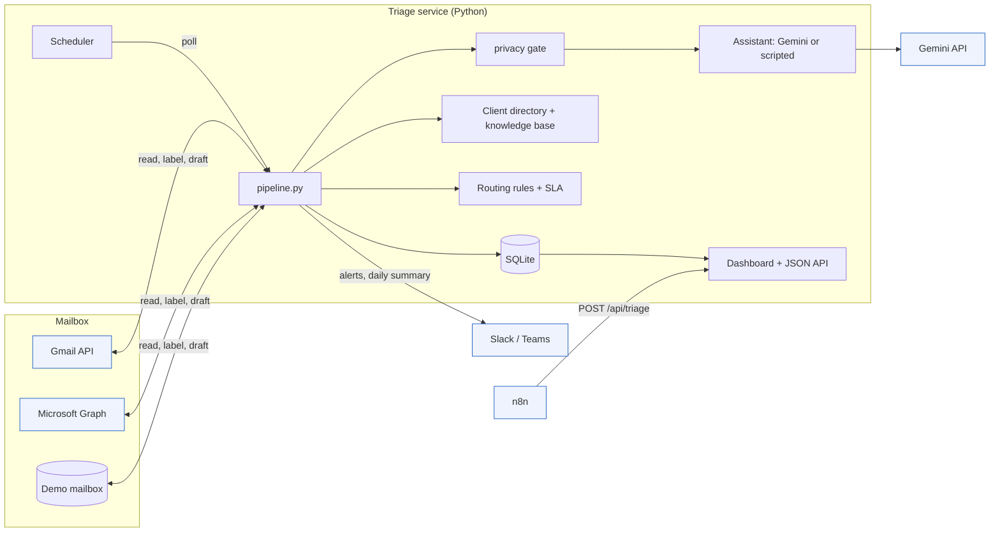
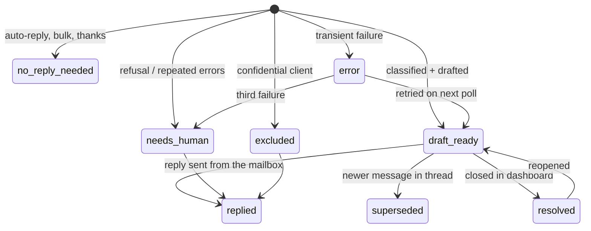

# Architecture

## One email, step by step (`pipeline.triage_email`)

1. **Skip what needs no AI.**
   - Auto-replies (`Auto-Submitted`, `X-Autoreply`) and bulk mail
     (`List-Unsubscribe`, `Precedence: bulk`) are closed as "no reply needed".
   - A thread the team has already answered is closed as "replied".
2. **Privacy gate.** Excluded clients are labelled `AI/Excluded`, routed by
   rules, and stored as metadata only. They stop here.
3. **Classify.** `Assistant.classify` returns a `Classification`: category,
   urgency and its reason, sentiment, complexity, confidence, questions,
   escalation flags, knowledge-base queries, and a claimed company (display
   only).
4. **No reply needed?** Thank-you notes and similar are closed.
5. **Context.** The client record (with the account manager's name), the
   client's last three queries, and the top four knowledge-base sections for
   the classifier's queries (at most three per article). Each gets a stable id
   such as `KB:refund-policy#annual-plans` or `CLIENT:acme-logistics`.
6. **Draft.**
   - `Assistant.draft` returns the body, citations, missing information and a
     confidence score.
   - Citations to unknown ids are dropped.
   - The text saved in the mailbox is the reviewer note, then the body, then
     the configured signature.
7. **Save and label.** The reply draft goes into the thread, and the
   `AI/Urgency/…`, `AI/Category/…`, `AI/Client/…`, `AI/Assigned/…` and
   `AI/Draft ready` labels are added.
8. **Route.** The first matching rule in `routing.yaml` picks the assignee.
   The reply-by time is received time + hours[urgency] × multiplier[tier].
   Critical or high urgency, or a rule with `alert: true`, posts to Slack or
   Teams.
9. **Supersede.** Older open queries in the same thread are closed as
   superseded. Their drafts are deleted only if nobody has edited them.

Failures:

- A refusal becomes "needs a person", routed by the `needs-human` rule.
- Transient errors leave the query in `error`. It is retried on the next
  poll, and after three attempts it becomes "needs a person".

## Query lifecycle

Open statuses (counted in the queue and the daily summary): `draft_ready`,
`needs_human`, `excluded`, `error`.

## Gemini requests

Each email makes two requests with the same shape, both sent to
`client.models.generate_content` (Google Gen AI SDK, model `GEMINI_MODEL`,
default `gemini-3.8-flash`):

- `system_instruction`: the frozen prompt plus the business profile. It is
  identical for every email, so Gemini's implicit caching can reuse it. Cached
  tokens are logged per call.
- `contents`: one user turn containing the client record, the email and
  earlier thread messages. The draft request also includes the sources, the
  triage summary and an optional teammate instruction.
- `response_mime_type: application/json`, with `response_schema` set to the
  Pydantic model (`Classification` or `DraftResult`).
- `thinking_config.thinking_level`: `TRIAGE_THINKING` (default `low`) or
  `DRAFT_THINKING` (default `medium`).
- The SDK retries 429s, 5xx and connection errors up to 3 times.

The response is validated only after its status is checked:

- A blocked prompt, or a `SAFETY`, `PROHIBITED_CONTENT`, `BLOCKLIST`, `SPII`
  or `RECITATION` finish, means the query goes to a person.
- `MAX_TOKENS` and 429/5xx errors are retried on the next poll.
- Other 4xx errors go straight to a person.

## Storage

One SQLite file with WAL mode and one short-lived connection per unit of work:

| Table | Holds |
|---|---|
| `queries` | One row per inbound email: classification, routing, due time, status, labels |
| `drafts` | Every draft version, with citations, dropped citations, missing info and the mailbox draft id and version |
| `query_sources` | The context given to the model for each query |
| `llm_calls` | Model, token counts and cache reads per call |
| `notifications` | Every alert and summary, as sent or as it would be sent |
| `audit` | What happened to each query and who did it |
| `kb_articles`, `kb_chunks` | Knowledge base and its FTS5 index |
| `demo_messages`, `demo_drafts` | The offline demo mailbox |

## Extension points

| Interface | Implementations | Add |
|---|---|---|
| `MailProvider` | Gmail, Graph, demo | IMAP (drafts via `APPEND` to Drafts), Front, Help Scout |
| `Assistant` | Gemini, scripted mock | another model provider |
| `KnowledgeSource` | LocalKB (FTS5), HttpKB | vector search, Confluence, Notion |
| `ClientDirectory` | CSV | CRM lookup (HubSpot, Salesforce) |
| `Notifier` | log, Slack, Teams | email summary to managers |
